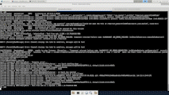

# euro-tracker-nexpay

## Description

This project was built with an external API called Twilio for sending Whatsapp messages. Programming language is Java Core, Spark framework for REST calls, and Selenium.

This project opens up a Firefox browser and gets the current value of one euro per mexican peso for nexpay.com.au platform.



The main purpose of the project is to send an outgoing WhatsApp message for each number / customer registered with the current Mexican currency value. If the value of the Mexican peso is less than $ 24.0 mxn per euro, this function will notify you every 2 hours.

Another feature is to get the current value of the Mexican currency 24/7 simply by answering anything to the Twilio number and it will respond with the current currency of the Mexican peso per euro.

# How to build it and create a JAR
```shell
$ ./gradlew clean build
```
```shell
$ ./gradlew jar
```
> The jar file will be created under ../build/libs
# How to execute it

```shell
$ nohup java -jar nexpay-1.0-SNAPSHOT.jar > ~/tracking.log 2>&1 &
```


